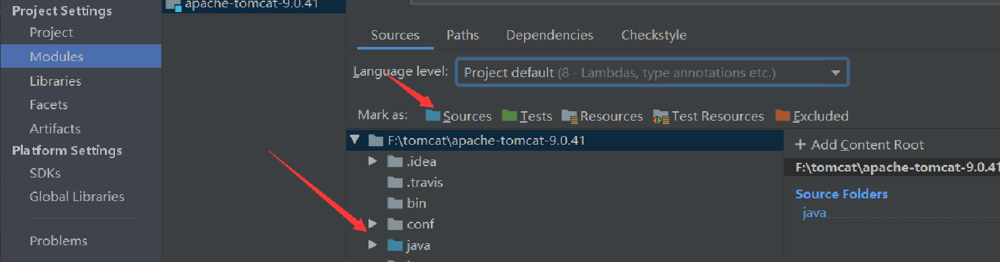
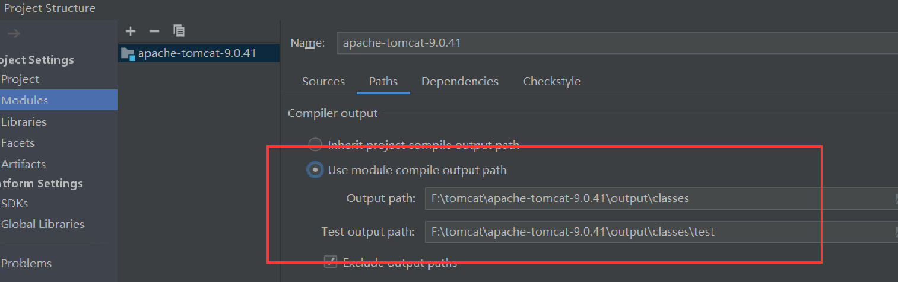
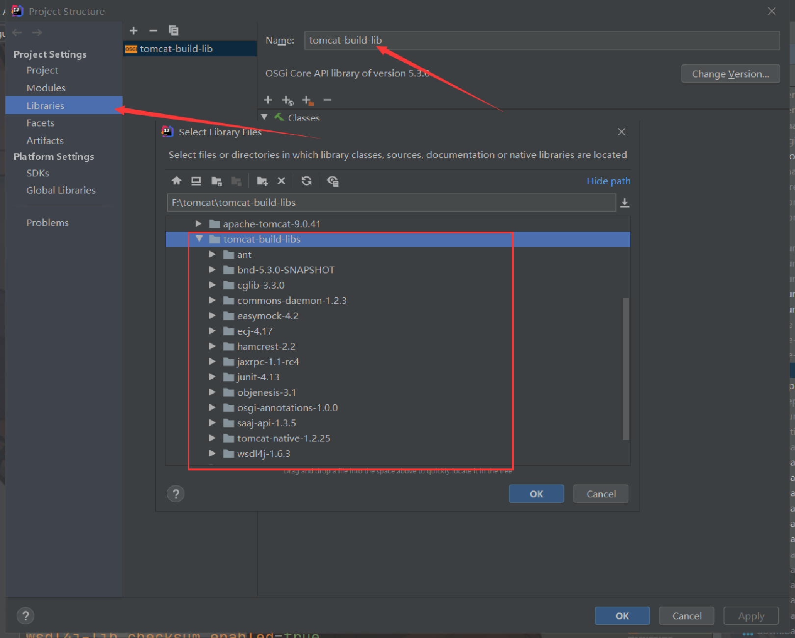

.. 搭建编译环境
. 安装Ant,Jdk
. 把源码复制到指定目录（你要安装的目录，我目录的是 F:\tomcat\apache-tomcat-9.0.41）
. 用Idea打开源码目录，构建Ant项目
. 配置build.xml文件， <property file="build.properties"/>
. 复制build.properties.default文件为build.properties
. 配置项目构建（编译）依赖的Jar包，即： 修改build.properties中的属性为 base.path=F:/tomcat/tomcat-build-libs
. 使用Ant的’download-compile‘Target下载依赖Jar包，下载的Jar包目录就是base.path的路径（有的Jar包可能需要Vpn才能下载）
. 使用Ant的’deploy‘Target开始编译项目，至此完成项目编译.

.. 配置运行环境
. 配置项目源码目录和输出路径（项目运行时要通过这个路径找到class文件） +
 + 

. 配置项目运行时需要依赖的Jar包，因为项目编译时使用的是Ant，它会自己去tomcat-build-lib目录中找到依赖，但是Idea中Main方法运行时会执行Idea中的build操作，此时也需要Jar包依赖.

. 配置Web应用的路径 F:\tomcat\apache-tomcat-9.0.41\output\build . +
image:static/webapp_path.png[]
. 配置完成，运行项目.

https://asciidoctor.cn/docs/asciidoc-syntax-quick-reference/index.html[Asciidoctor语法]